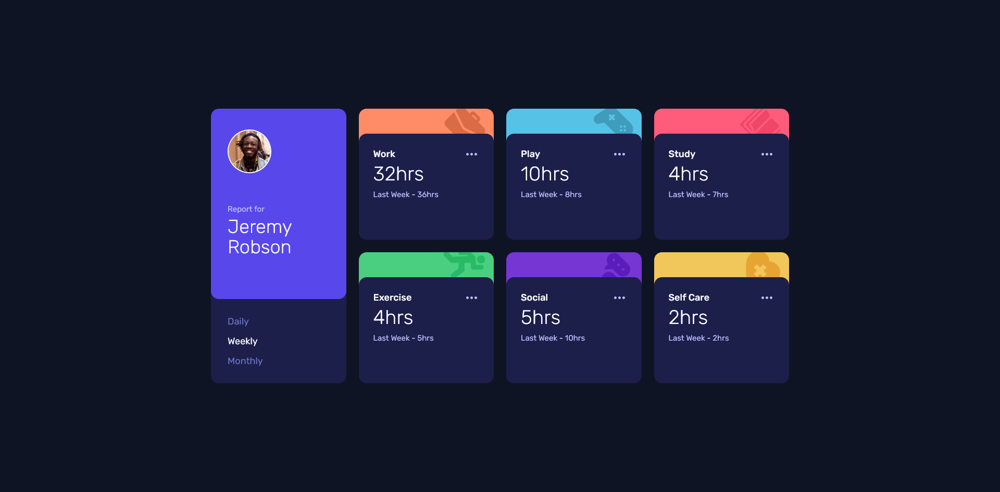

# Frontend Mentor - Time Tracking Dashboard Solution

This is a solution to the [Time Tracking Dashboard challenge on Frontend Mentor](https://www.frontendmentor.io/challenges/time-tracking-dashboard-UIQ7167Jw). Frontend Mentor challenges help you improve your coding skills by building realistic projects.

## Table of contents

- [Overview](#overview)
  - [The challenge](#the-challenge)
  - [Screenshot](#screenshot)
  - [Links](#links)
- [My process](#my-process)
  - [Built with](#built-with)
  - [What I learned](#what-i-learned)
- [Author](#author)

## Overview

### The challenge

Users should be able to:

- Switch between viewing Daily, Weekly, and Monthly stats
- View the optimal layout for the site depending on their device's screen size
- See hover states for all interactive elements on the page

### Screenshot



### Links

- [Solution](https://github.com/Kking927/time-tracking-dashboard)
- [Live Site](https://kking927.github.io/time-tracking-dashboard/)

## My process

### Built with

- Semantic HTML5 markup
- CSS Custom Properties
- Flexbox
- CSS Grid
- Mobile-first workflow
- Vanilla JavaScript
- JSON data
- Fetch API
- DOM manipulation

### What I learned

This project gave me practice combining responsive CSS with JavaScript-driven content updates. I also practiced working with external JSON data and using `data-*` attributes to connect UI controls with JavaScript functionality.

- **Working with JSON Data:** Used the provided `data.json` file to store the activity information and practiced retrieving the appropriate values for each timeframe instead of hardcoding the Daily, Weekly, and Monthly statistics directly into the HTML.

- **Dynamic Timeframe Switching:** Used `data-timeframe` attributes on the Daily, Weekly, and Monthly buttons to identify the selected timeframe. JavaScript uses that value to retrieve the corresponding data and update the activity cards.

```js
// Example: Using a data attribute to determine the selected timeframe
const timeframe = button.dataset.timeframe;

const timeframeData = activity.timeframes[timeframe];

currentTimeElement.textContent = `${timeframeData.current}hrs`;
previousTimeElement.textContent = `Last ${periodLabel} - ${timeframeData.previous}hrs`;
```

- **DOM Manipulation:** Practiced selecting elements and updating their `textContent` based on the currently selected timeframe. This helped reinforce how JavaScript can control what users see without requiring the page to reload.
  
- **Responsive CSS:** Used a mobile-first layout that changes to a four-column CSS Grid layout on larger screens. I also used `clamp()` for selected typography, spacing, and sizing values so the design can scale smoothly between viewport sizes.
  
- **Reusable CSS Custom Properties:** Created custom properties for colors, typography, border radii, and effects. For example, a reusable hover brightness value can be applied to multiple interactive elements:

```css
:root {
  --hover-brightness: brightness(1.25);
}

.activity-card__content:hover {
  filter: var(--hover-brightness);
}
```

- **Interactive States and Accessibility:** Added hover and active states to interactive elements and practiced using `prefers-reduced-motion` to prevent decorative transitions and animations from creating unnecessary motion for users who have requested reduced motion.
  
- **Debugging and Project Organization:** Worked through issues involving the relationship between HTML, CSS, JavaScript, JSON data, and asset files. This reinforced the importance of establishing a clear project structure and understanding how each file is loaded and referenced.

## Author

- Frontend Mentor - [@Kking927](https://www.frontendmentor.io/profile/Kking927)
- GitHub - [@Kking927](https://github.com/Kking927)
